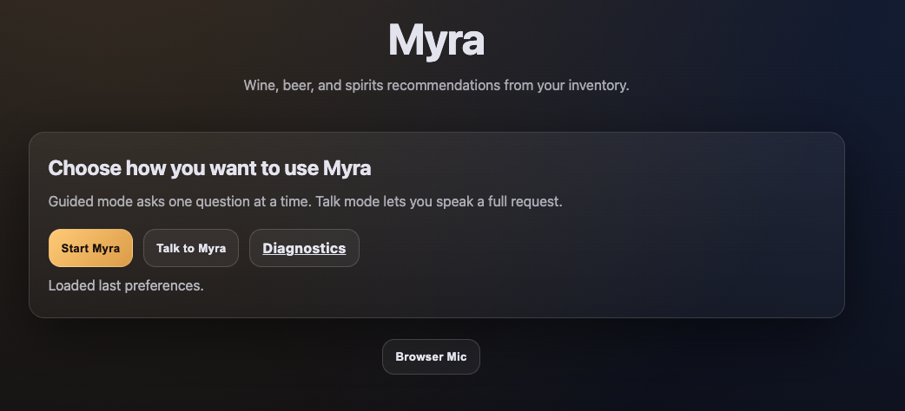
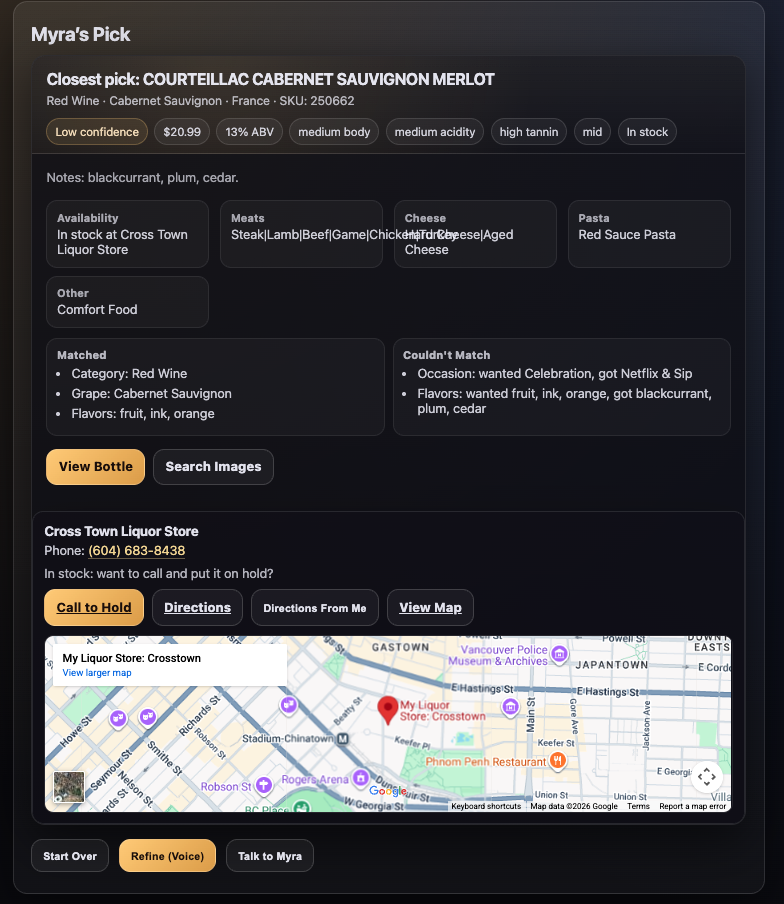

# 🍷 Myra — AI Virtual Sommelier & Bar Intelligence System

**Myra** is a voice-enabled, constraint-based wine, beer, and spirits recommendation engine designed to bridge the gap between AI novelty and real-world retail conversion.

She doesn’t just recommend drinks.  
She closes decisions.

Live Demo:  
🔗 https://robbiecalvin.github.io/myra/

---

## 🧠 What Makes Myra Different?

Most recommendation systems are:
- Static
- Inventory-blind
- Non-conversational
- Non-actionable

Myra is built differently.

She operates on four core principles:

---

### 1️⃣ Dual Interaction Model

Users can interact with Myra in two ways:

**Guided Mode**
- Myra asks structured questions
- Budget
- Occasion
- Pairing
- Color
- Country
- Vibe
- Alcohol type

**Free-Form Mode**

Users can say something like:

> “I need a dry red under $25 for steak but keep it European.”

Myra extracts intent from messy human language and maps it to structured constraints.

---

### 2️⃣ Constraint-Based Recommendations

Recommendations are built using layered filtering logic:

- Budget ceilings  
- Category (wine, beer, spirits)  
- Origin  
- Flavor profile  
- Occasion  
- Food pairing  
- Inventory availability  

If no perfect match exists, Myra:
- Explains why  
- Identifies the constraint conflict  
- Suggests the closest viable alternative  

No hallucinated nonsense. No blind guessing.

---

### 3️⃣ Inventory Awareness

Myra is tied to real store inventory.

This transforms her from:
> “fun AI demo”

Into:
> “retail conversion engine”

Recommendations include:
- In-stock verification  
- Store phone number  
- Hold instructions  
- Directions  

She doesn’t recommend for entertainment.  
She recommends to sell.

---

### 4️⃣ Voice Integration

Myra supports:

- Voice input  
- Natural language parsing  
- Conversational response formatting  

This allows:
- Hands-free interaction  
- Natural decision flow  
- On-the-floor retail usability  

---

## 🏗 Architecture Overview

Myra is built as a lightweight, client-side application optimized for:

- Mobile-first interaction  
- Fast response rendering  
- Clear conversational UI  
- Constraint parsing logic  
- Structured product dataset  

Core Components:

- Inventory JSON dataset  
- Intent extraction logic  
- Constraint filtering engine  
- Conversational response generator  
- Voice recognition interface  
- UI rendering layer  

No heavy frameworks.  
No server dependencies.  
Fast. Portable. Scalable.

---

## 🎯 Business Applications

Myra can be deployed as:

- Liquor store in-store assistant  
- Retail website recommendation widget  
- Event planning drink calculator  
- Digital sommelier for restaurants  
- Bar inventory assistant  
- Hospitality upsell tool  

Future evolutions:

- Full bar inventory manager  
- Event quantity estimator  
- Cocktail mixologist assistant  
- POS-integrated upsell engine  

---

## 💡 Example Use Cases

**Wine Pairing**
> “Dry red under $30 for steak dinner, European.”

**Budget Planning**
> “Best whiskey under $40 for a gift.”

**Event Planning**
> “What should I serve at a summer patio party?”

**Inventory Check**
> “What’s in stock right now for under $25?”

---

## 🚀 Roadmap

Planned Evolutions:

- 🔊 Advanced conversational memory  
- 📊 Predictive upsell suggestions  
- 📦 Bar inventory management mode  
- 🍸 Cocktail recipe integration  
- 📈 Sales analytics layer  
- 🗺 Multi-store expansion  
- 🛒 E-commerce integration  

---

## 🧪 Current Status

Myra is a fully functional live prototype with:

- Dual-mode interaction  
- Constraint filtering  
- Real inventory mapping  
- Voice activation  
- Retail conversion hooks  

She is beyond demo stage.

Next step: scale.

---

## 👤 Created By

Robbie Calvin Mitchell  
AI Systems Developer & Product Architect  
https://robbiecalvin.com

---

## 📜 License

MIT (recommended)  
Or specify your preferred license.

---

## Final Note

Myra represents the shift from:

> AI as novelty

To:

> AI as operational retail intelligence.

This project explores how conversational AI can drive real-world commerce without sacrificing constraint integrity, user trust, or clarity.

