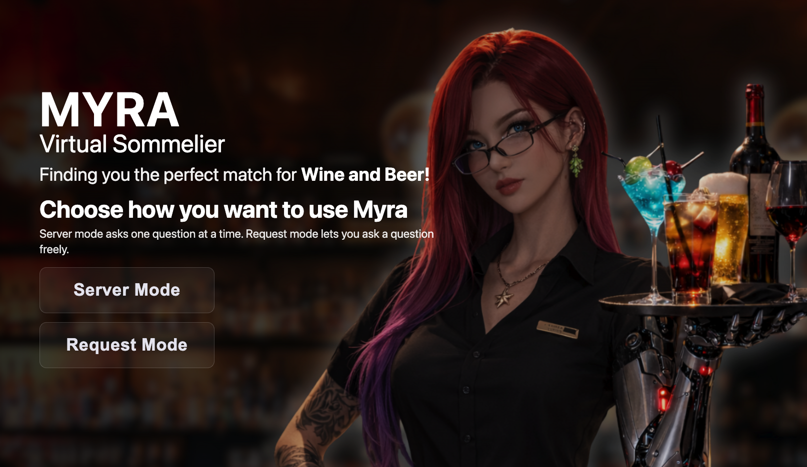
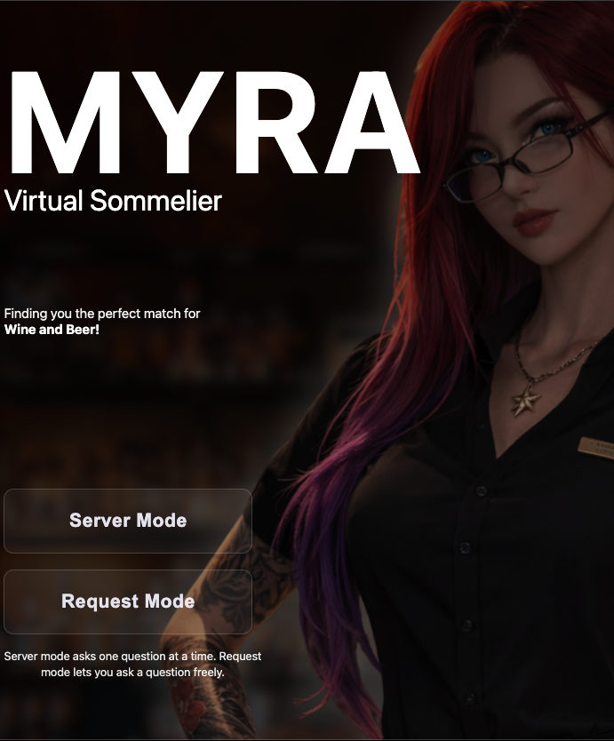
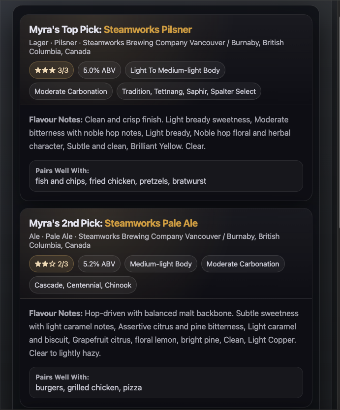
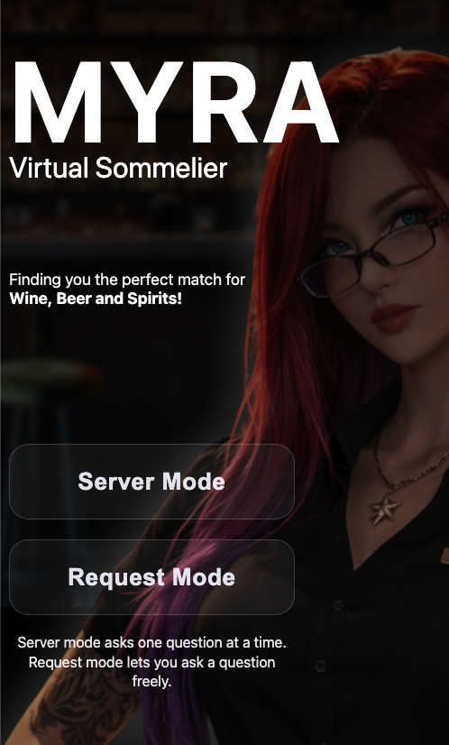
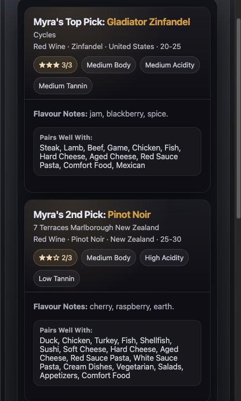

# Myra - Virtual Sommelier

Myra is a browser-based recommendation experience focused on **Wine and Beer** with:
- Web experience in `/index.html`
- Backend API in `/backend`

## Version

Current version: `v0.3`

## What’s New

- Home, guided flow, and results experience updated with responsive desktop/tablet/mobile visual system
- Guided mode and request mode streamlined for Wine + Beer
- Wine and Beer results now use aligned top-3 recommendation card patterns
- Retailer handoff section integrated into results flow
- Social sharing metadata support added on the web entry page

## Screenshots

### Desktop




### Tablet




### Mobile




## Project Layout

- `/index.html` - legacy web entry experience
- `/css` - styling for web experience
- `/js` - client-side voice + parsing modules
- `/data` - recommendation data and mappings
- `/backend` - Express API and services

## Local Development

### Backend

```bash
cd backend
npm install
npm run migrate
npm run dev
```

Backend default URL: `http://localhost:4000`

### Web (Legacy)

Open `/index.html` in your local dev server setup.

## Verification Commands

```bash
cd backend && npm run lint && npm run build
```

## Update Report

See: [`myra-v0.3-updates.md`](myra-v0.3-updates.md)
